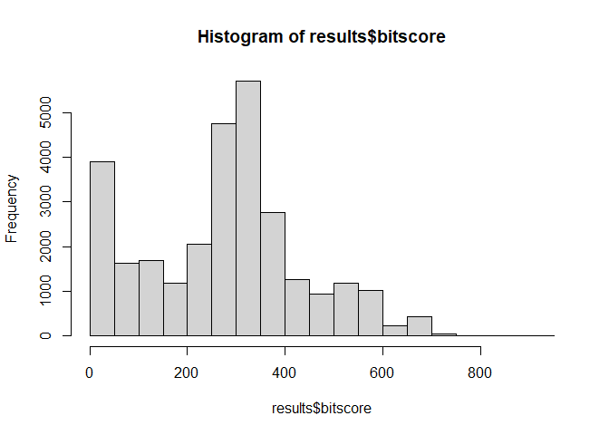
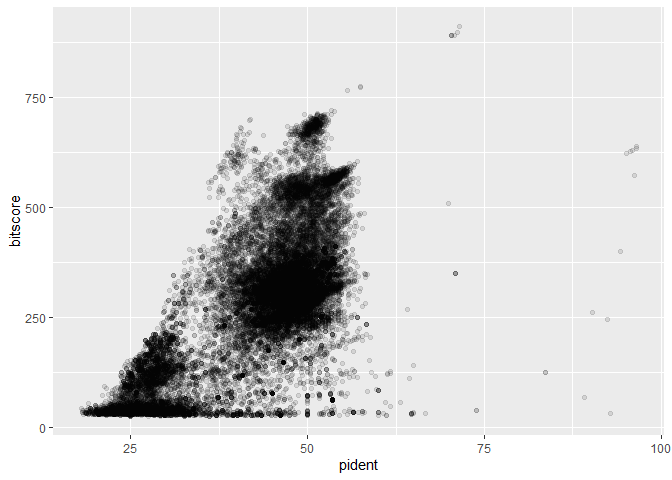
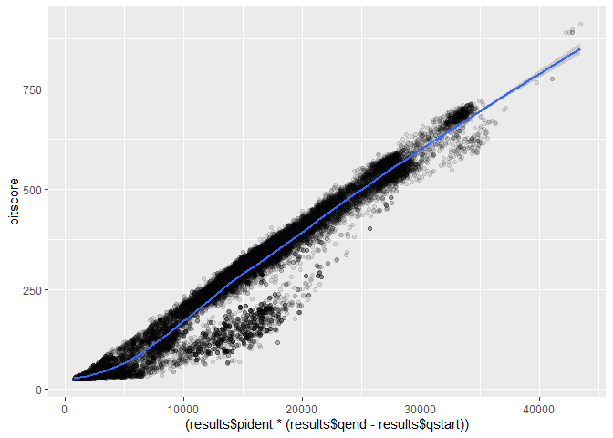

# Class 17: BLAST on AWS
Nicolò (PID: 18109144)

## 10. Using RStudio online (or locally) to read your output

Read your mm-second.x.zebrafish.tsv. Set the colnames to be:

``` r
col_names <- c("qseqid", "sseqid", "pident", "length", "mismatch", "gapopen", "qstart", "qend", "sstart", "send", "evalue", "bitscore")
```

``` r
results <- read.delim("results.tsv", col.names = col_names)
```

Make a histogram of the `$bitscore` values. You may want to set the
optional breaks to be a larger number (e.g. `breaks=30`).

``` r
hist(results$bitscore, breaks=30)
```



Is there a straightforward relationship between percent identity
(`$pident`) and bitscore (`$bitscore`) for the alignments we generated?

``` r
library(ggplot2)
ggplot(results, aes(pident, bitscore)) + geom_point(alpha=0.1)
```



``` r
ggplot(results, aes((results$pident * (results$qend - results$qstart)), bitscore)) + geom_point(alpha=0.1) + geom_smooth()
```

    Warning: Use of `results$pident` is discouraged.
    ℹ Use `pident` instead.

    Warning: Use of `results$qend` is discouraged.
    ℹ Use `qend` instead.

    Warning: Use of `results$qstart` is discouraged.
    ℹ Use `qstart` instead.

    Warning: Use of `results$pident` is discouraged.
    ℹ Use `pident` instead.

    Warning: Use of `results$qend` is discouraged.
    ℹ Use `qend` instead.

    Warning: Use of `results$qstart` is discouraged.
    ℹ Use `qstart` instead.

    `geom_smooth()` using method = 'gam' and formula = 'y ~ s(x, bs = "cs")'


