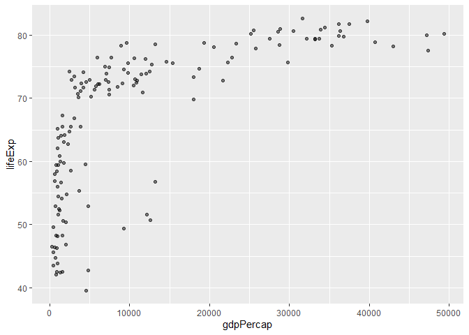

# Class05 Data Visualization with ggplot2
Nicolò (PID: A18109114)

## Using GGPLOT

The ggplot2 package needs to be intalled as it does not with R “out of
the box”.

We use the `install.packages()` function to do this.

``` r
head(cars)
```

      speed dist
    1     4    2
    2     4   10
    3     7    4
    4     7   22
    5     8   16
    6     9   10

To use ggplot I need to load it up before I can call any of the
functions in the package. I do this with the `library()` function.

``` r
library(ggplot2)
ggplot()
```


All ggplot figures have at least 3 things: - data (the stuff we want to
plot) - aesthetic mapping (aes values) - geoms

``` r
ggplot(cars) +
  aes(x=speed, y=dist) +
  geom_point()
```


ggplot is not the only graphing system in R there are lots of others.
THere is even “base R” graphics.

``` r
plot(cars)
```


In ggplot we can add a trend line

``` r
ggplot(cars) +
  aes(x=speed, y=dist) +
  geom_point() +
  geom_smooth()
```

    `geom_smooth()` using method = 'loess' and formula = 'y ~ x'


We can also make it straight and remove the SE region

``` r
ggplot(cars) +
  aes(x=speed, y=dist) +
  geom_point() +
  geom_smooth(method="lm", se=FALSE)
```

    `geom_smooth()` using formula = 'y ~ x'


And add informative descriptions

``` r
ggplot(cars) +
  aes(x=speed, y=dist) +
  geom_point() +
  labs(title = "Speed and Stopping Distances of Cars",
       x = "Speed (MPH)",
       y = "Stopping Distance (ft)",
       subtitle = "Speed and Stopping Distances of Cars appear to be positively correlated",
       caption="Dataset: 'cars'") +
  geom_smooth(method="lm", se=FALSE) +
  theme_bw()
```

    `geom_smooth()` using formula = 'y ~ x'


# Adding more plot aesthetics through aes()

``` r
url <- "https://bioboot.github.io/bimm143_S20/class-material/up_down_expression.txt"
genes <- read.delim(url)
head(genes)
```

            Gene Condition1 Condition2      State
    1      A4GNT -3.6808610 -3.4401355 unchanging
    2       AAAS  4.5479580  4.3864126 unchanging
    3      AASDH  3.7190695  3.4787276 unchanging
    4       AATF  5.0784720  5.0151916 unchanging
    5       AATK  0.4711421  0.5598642 unchanging
    6 AB015752.4 -3.6808610 -3.5921390 unchanging

Let’s find out the number of rows

``` r
nrow(genes)
```

    [1] 5196

What’s the number of columns and their names?

``` r
ncol(genes)
```

    [1] 4

``` r
colnames(genes)
```

    [1] "Gene"       "Condition1" "Condition2" "State"     

How many genes are upregulated?

``` r
table(genes$State)
```


          down unchanging         up 
            72       4997        127 

Fraction of the total genes that’s upregulated:

``` r
round( table(genes$State)/nrow(genes) * 100, 2 )
```


          down unchanging         up 
          1.39      96.17       2.44 

Let’s plot this data

``` r
ggplot(genes) + 
  aes(x=Condition1, y=Condition2) +
  geom_point()
```


With color

``` r
p <- ggplot(genes) + 
    aes(x=Condition1, y=Condition2, col=State) +
    geom_point()
p
```


Other colors

``` r
p + scale_colour_manual( values=c("blue","gray","red") )
```


And annotation

``` r
p + scale_colour_manual( values=c("blue","gray","red") ) + labs(title = "Gene Expression Changes Upon Drug Treatment")
```


## Extra credit lab

We get the data

``` r
# File location online
url <- "https://raw.githubusercontent.com/jennybc/gapminder/master/inst/extdata/gapminder.tsv"

gapminder <- read.delim(url)
```

And filter just data from 2007

``` r
library(dplyr)
```

    Warning: package 'dplyr' was built under R version 4.3.2


    Attaching package: 'dplyr'

    The following objects are masked from 'package:stats':

        filter, lag

    The following objects are masked from 'package:base':

        intersect, setdiff, setequal, union

``` r
gapminder_2007 <- gapminder %>% filter(year==2007)
```

Now do a basic plot

``` r
ggplot(gapminder_2007) +
  aes(x=gdpPercap, y=lifeExp) +
  geom_point()
```


Let’s make overlapping dots more distinguishable

``` r
ggplot(gapminder_2007) +
  aes(x=gdpPercap, y=lifeExp) +
  geom_point(alpha=0.5)
```



And color!

``` r
ggplot(gapminder_2007) +
  aes(x=gdpPercap, y=lifeExp, color=continent, size=pop) +
  geom_point(alpha=0.5)
```


Or we could just color the dots by population

``` r
ggplot(gapminder_2007) + 
  aes(x = gdpPercap, y = lifeExp, color = pop) +
  geom_point(alpha=0.8)
```


The dots’ size is not to scale, let’s fix that

``` r
ggplot(gapminder_2007) + 
  geom_point(aes(x = gdpPercap, y = lifeExp,
                 size = pop), alpha=0.5) + 
  scale_size_area(max_size = 10)
```


We now do it again for year 1957

``` r
gapminder_1957 <- gapminder %>% filter(year==1957)

ggplot(gapminder_1957) +
  aes(x=gdpPercap, y=lifeExp, color=continent, size=pop) +
  geom_point(alpha=0.7) +
  scale_size_area(max_size = 15)
```


And compare it to 2007

``` r
gapminder_1957 <- gapminder %>% filter(year==1957 | year==2007)

ggplot(gapminder_1957) + 
  geom_point(aes(x = gdpPercap, y = lifeExp, color=continent,
                 size = pop), alpha=0.7) + 
  scale_size_area(max_size = 10) +
  facet_wrap(~year)
```


# Bar charts

``` r
gapminder_top5 <- gapminder %>% 
  filter(year==2007) %>% 
  arrange(desc(pop)) %>% 
  top_n(5, pop)

gapminder_top5
```

            country continent year lifeExp        pop gdpPercap
    1         China      Asia 2007  72.961 1318683096  4959.115
    2         India      Asia 2007  64.698 1110396331  2452.210
    3 United States  Americas 2007  78.242  301139947 42951.653
    4     Indonesia      Asia 2007  70.650  223547000  3540.652
    5        Brazil  Americas 2007  72.390  190010647  9065.801

We can do a basic bar chart for population

``` r
ggplot(gapminder_top5) + 
  geom_col(aes(x = country, y = pop))
```


…or for life expectancy

``` r
ggplot(gapminder_top5) + 
  geom_col(aes(x = country, y = lifeExp))
```


We can also color the bars by continent

``` r
ggplot(gapminder_top5) + 
  geom_col(aes(x = country, y = pop, fill = continent))
```


…or by life expectancy

``` r
ggplot(gapminder_top5) + 
  geom_col(aes(x = country, y = pop, fill = lifeExp))
```


…or by gdpPercap

``` r
ggplot(gapminder_top5) +
  aes(x=country, y=pop, fill=gdpPercap) +
  geom_col()
```


Let’s reorder the bars by population (from biggest to lowest)

``` r
ggplot(gapminder_top5) +
  aes(x=reorder(country, -pop), y=pop, fill=gdpPercap) +
  geom_col()
```


Now we fill by country

``` r
ggplot(gapminder_top5) +
  aes(x=reorder(country, -pop), y=pop, fill=country) +
  geom_col(col="grey30") +
  guides(fill="none")
```


# Flipping bar charts

Let’s visualize arrests in the USA with flipped bar charts

``` r
head(USArrests)
```

               Murder Assault UrbanPop Rape
    Alabama      13.2     236       58 21.2
    Alaska       10.0     263       48 44.5
    Arizona       8.1     294       80 31.0
    Arkansas      8.8     190       50 19.5
    California    9.0     276       91 40.6
    Colorado      7.9     204       78 38.7

``` r
USArrests$State <- rownames(USArrests)
ggplot(USArrests) +
  aes(x=reorder(State,Murder), y=Murder) +
  geom_col() +
  coord_flip()
```


We can combine points and lines to make it more easily understandable

``` r
ggplot(USArrests) +
  aes(x=reorder(State,Murder), y=Murder) +
  geom_point() +
  geom_segment(aes(x=State, 
                   xend=State, 
                   y=0, 
                   yend=Murder), color="blue") +
  coord_flip()
```


# About this document

``` r
sessionInfo()
```

    R version 4.3.1 (2023-06-16 ucrt)
    Platform: x86_64-w64-mingw32/x64 (64-bit)
    Running under: Windows 11 x64 (build 22631)

    Matrix products: default


    locale:
    [1] LC_COLLATE=Italian_Italy.utf8  LC_CTYPE=Italian_Italy.utf8   
    [3] LC_MONETARY=Italian_Italy.utf8 LC_NUMERIC=C                  
    [5] LC_TIME=Italian_Italy.utf8    

    time zone: America/Los_Angeles
    tzcode source: internal

    attached base packages:
    [1] stats     graphics  grDevices utils     datasets  methods   base     

    other attached packages:
    [1] dplyr_1.1.4   ggplot2_3.4.4

    loaded via a namespace (and not attached):
     [1] vctrs_0.6.4       nlme_3.1-162      cli_3.6.1         knitr_1.45       
     [5] rlang_1.1.2       xfun_0.41         generics_0.1.3    jsonlite_1.8.7   
     [9] labeling_0.4.3    glue_1.6.2        colorspace_2.1-0  htmltools_0.5.7  
    [13] scales_1.3.0      fansi_1.0.5       rmarkdown_2.25    grid_4.3.1       
    [17] evaluate_0.23     munsell_0.5.0     tibble_3.2.1      fastmap_1.1.1    
    [21] yaml_2.3.7        lifecycle_1.0.4   compiler_4.3.1    pkgconfig_2.0.3  
    [25] mgcv_1.8-42       rstudioapi_0.15.0 lattice_0.21-8    farver_2.1.1     
    [29] digest_0.6.33     R6_2.5.1          tidyselect_1.2.0  utf8_1.2.4       
    [33] splines_4.3.1     pillar_1.9.0      magrittr_2.0.3    Matrix_1.5-4.1   
    [37] withr_2.5.2       tools_4.3.1       gtable_0.3.4     
