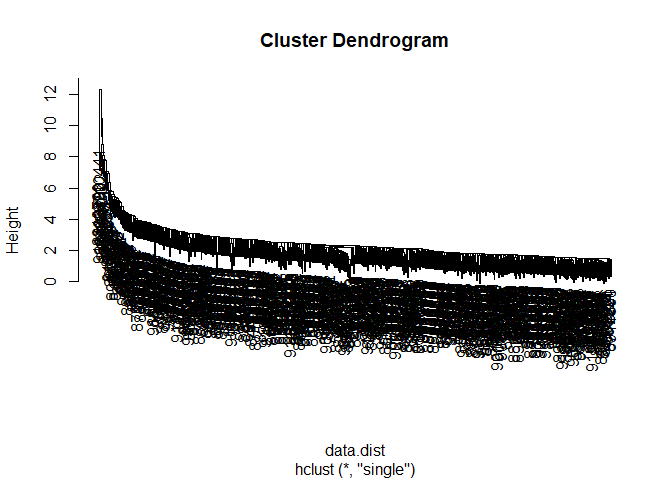

# Class 8 Mini-Project
Nicolò (PID: A18109144)

Today we will apply the machine learning methods we introduced in the
last class on breast cancer biopsy data from fine needle aspiration
(FNA)

## Data input

The data is supplied on CSV format:

``` r
wisc.df <- read.csv("WisconsinCancer.csv", row.names=1)
head(wisc.df)
```

             diagnosis radius_mean texture_mean perimeter_mean area_mean
    842302           M       17.99        10.38         122.80    1001.0
    842517           M       20.57        17.77         132.90    1326.0
    84300903         M       19.69        21.25         130.00    1203.0
    84348301         M       11.42        20.38          77.58     386.1
    84358402         M       20.29        14.34         135.10    1297.0
    843786           M       12.45        15.70          82.57     477.1
             smoothness_mean compactness_mean concavity_mean concave.points_mean
    842302           0.11840          0.27760         0.3001             0.14710
    842517           0.08474          0.07864         0.0869             0.07017
    84300903         0.10960          0.15990         0.1974             0.12790
    84348301         0.14250          0.28390         0.2414             0.10520
    84358402         0.10030          0.13280         0.1980             0.10430
    843786           0.12780          0.17000         0.1578             0.08089
             symmetry_mean fractal_dimension_mean radius_se texture_se perimeter_se
    842302          0.2419                0.07871    1.0950     0.9053        8.589
    842517          0.1812                0.05667    0.5435     0.7339        3.398
    84300903        0.2069                0.05999    0.7456     0.7869        4.585
    84348301        0.2597                0.09744    0.4956     1.1560        3.445
    84358402        0.1809                0.05883    0.7572     0.7813        5.438
    843786          0.2087                0.07613    0.3345     0.8902        2.217
             area_se smoothness_se compactness_se concavity_se concave.points_se
    842302    153.40      0.006399        0.04904      0.05373           0.01587
    842517     74.08      0.005225        0.01308      0.01860           0.01340
    84300903   94.03      0.006150        0.04006      0.03832           0.02058
    84348301   27.23      0.009110        0.07458      0.05661           0.01867
    84358402   94.44      0.011490        0.02461      0.05688           0.01885
    843786     27.19      0.007510        0.03345      0.03672           0.01137
             symmetry_se fractal_dimension_se radius_worst texture_worst
    842302       0.03003             0.006193        25.38         17.33
    842517       0.01389             0.003532        24.99         23.41
    84300903     0.02250             0.004571        23.57         25.53
    84348301     0.05963             0.009208        14.91         26.50
    84358402     0.01756             0.005115        22.54         16.67
    843786       0.02165             0.005082        15.47         23.75
             perimeter_worst area_worst smoothness_worst compactness_worst
    842302            184.60     2019.0           0.1622            0.6656
    842517            158.80     1956.0           0.1238            0.1866
    84300903          152.50     1709.0           0.1444            0.4245
    84348301           98.87      567.7           0.2098            0.8663
    84358402          152.20     1575.0           0.1374            0.2050
    843786            103.40      741.6           0.1791            0.5249
             concavity_worst concave.points_worst symmetry_worst
    842302            0.7119               0.2654         0.4601
    842517            0.2416               0.1860         0.2750
    84300903          0.4504               0.2430         0.3613
    84348301          0.6869               0.2575         0.6638
    84358402          0.4000               0.1625         0.2364
    843786            0.5355               0.1741         0.3985
             fractal_dimension_worst
    842302                   0.11890
    842517                   0.08902
    84300903                 0.08758
    84348301                 0.17300
    84358402                 0.07678
    843786                   0.12440

``` r
# We can use -1 here to remove the first column
wisc.data <- wisc.df[,-1]
# Create diagnosis vector for later 
diagnosis <- as.factor(wisc.df$diagnosis)
```

> Q1. How many observations are in this dataset?

``` r
nrow(wisc.data)
```

    [1] 569

> Q2. How many of the observations have a malignant diagnosis?

``` r
sum(diagnosis == "M")
```

    [1] 212

> Q3. How many variables/features in the data are suffixed with \_mean?

``` r
# Retrieve column names
colnames(wisc.data)
```

     [1] "radius_mean"             "texture_mean"           
     [3] "perimeter_mean"          "area_mean"              
     [5] "smoothness_mean"         "compactness_mean"       
     [7] "concavity_mean"          "concave.points_mean"    
     [9] "symmetry_mean"           "fractal_dimension_mean" 
    [11] "radius_se"               "texture_se"             
    [13] "perimeter_se"            "area_se"                
    [15] "smoothness_se"           "compactness_se"         
    [17] "concavity_se"            "concave.points_se"      
    [19] "symmetry_se"             "fractal_dimension_se"   
    [21] "radius_worst"            "texture_worst"          
    [23] "perimeter_worst"         "area_worst"             
    [25] "smoothness_worst"        "compactness_worst"      
    [27] "concavity_worst"         "concave.points_worst"   
    [29] "symmetry_worst"          "fractal_dimension_worst"

``` r
# Look for the variables that are suffixed with "_mean"
grep("_mean", colnames(wisc.data))
```

     [1]  1  2  3  4  5  6  7  8  9 10

``` r
# Count the variables
length(grep("_mean", colnames(wisc.data)))
```

    [1] 10

# Principal Component Analysis

## Performing PCA

``` r
# Check column means and standard deviations
colMeans(wisc.data)
```

                radius_mean            texture_mean          perimeter_mean 
               1.412729e+01            1.928965e+01            9.196903e+01 
                  area_mean         smoothness_mean        compactness_mean 
               6.548891e+02            9.636028e-02            1.043410e-01 
             concavity_mean     concave.points_mean           symmetry_mean 
               8.879932e-02            4.891915e-02            1.811619e-01 
     fractal_dimension_mean               radius_se              texture_se 
               6.279761e-02            4.051721e-01            1.216853e+00 
               perimeter_se                 area_se           smoothness_se 
               2.866059e+00            4.033708e+01            7.040979e-03 
             compactness_se            concavity_se       concave.points_se 
               2.547814e-02            3.189372e-02            1.179614e-02 
                symmetry_se    fractal_dimension_se            radius_worst 
               2.054230e-02            3.794904e-03            1.626919e+01 
              texture_worst         perimeter_worst              area_worst 
               2.567722e+01            1.072612e+02            8.805831e+02 
           smoothness_worst       compactness_worst         concavity_worst 
               1.323686e-01            2.542650e-01            2.721885e-01 
       concave.points_worst          symmetry_worst fractal_dimension_worst 
               1.146062e-01            2.900756e-01            8.394582e-02 

``` r
apply(wisc.data,2,sd)
```

                radius_mean            texture_mean          perimeter_mean 
               3.524049e+00            4.301036e+00            2.429898e+01 
                  area_mean         smoothness_mean        compactness_mean 
               3.519141e+02            1.406413e-02            5.281276e-02 
             concavity_mean     concave.points_mean           symmetry_mean 
               7.971981e-02            3.880284e-02            2.741428e-02 
     fractal_dimension_mean               radius_se              texture_se 
               7.060363e-03            2.773127e-01            5.516484e-01 
               perimeter_se                 area_se           smoothness_se 
               2.021855e+00            4.549101e+01            3.002518e-03 
             compactness_se            concavity_se       concave.points_se 
               1.790818e-02            3.018606e-02            6.170285e-03 
                symmetry_se    fractal_dimension_se            radius_worst 
               8.266372e-03            2.646071e-03            4.833242e+00 
              texture_worst         perimeter_worst              area_worst 
               6.146258e+00            3.360254e+01            5.693570e+02 
           smoothness_worst       compactness_worst         concavity_worst 
               2.283243e-02            1.573365e-01            2.086243e-01 
       concave.points_worst          symmetry_worst fractal_dimension_worst 
               6.573234e-02            6.186747e-02            1.806127e-02 

``` r
# Perform PCA on wisc.data by completing the following code
wisc.pr <- prcomp(wisc.data, scale = TRUE)
# Look at summary of results
summary(wisc.pr)
```

    Importance of components:
                              PC1    PC2     PC3     PC4     PC5     PC6     PC7
    Standard deviation     3.6444 2.3857 1.67867 1.40735 1.28403 1.09880 0.82172
    Proportion of Variance 0.4427 0.1897 0.09393 0.06602 0.05496 0.04025 0.02251
    Cumulative Proportion  0.4427 0.6324 0.72636 0.79239 0.84734 0.88759 0.91010
                               PC8    PC9    PC10   PC11    PC12    PC13    PC14
    Standard deviation     0.69037 0.6457 0.59219 0.5421 0.51104 0.49128 0.39624
    Proportion of Variance 0.01589 0.0139 0.01169 0.0098 0.00871 0.00805 0.00523
    Cumulative Proportion  0.92598 0.9399 0.95157 0.9614 0.97007 0.97812 0.98335
                              PC15    PC16    PC17    PC18    PC19    PC20   PC21
    Standard deviation     0.30681 0.28260 0.24372 0.22939 0.22244 0.17652 0.1731
    Proportion of Variance 0.00314 0.00266 0.00198 0.00175 0.00165 0.00104 0.0010
    Cumulative Proportion  0.98649 0.98915 0.99113 0.99288 0.99453 0.99557 0.9966
                              PC22    PC23   PC24    PC25    PC26    PC27    PC28
    Standard deviation     0.16565 0.15602 0.1344 0.12442 0.09043 0.08307 0.03987
    Proportion of Variance 0.00091 0.00081 0.0006 0.00052 0.00027 0.00023 0.00005
    Cumulative Proportion  0.99749 0.99830 0.9989 0.99942 0.99969 0.99992 0.99997
                              PC29    PC30
    Standard deviation     0.02736 0.01153
    Proportion of Variance 0.00002 0.00000
    Cumulative Proportion  1.00000 1.00000

> Q4. From your results, what proportion of the original variance is
> captured by the first principal components (PC1)?

0.4427

> Q5. How many principal components (PCs) are required to describe at
> least 70% of the original variance in the data?

3, since PC3 is the first principal component to have a cumulative
proportion \>70% (72.636%).

> Q6. How many principal components (PCs) are required to describe at
> least 90% of the original variance in the data?

7, since PC7 is the first principal component to have a cumulative
proportion \>70% (91.010%).

## Interpreting PCA results

Create a biplot of the wisc.pr using the biplot() function.

``` r
biplot(wisc.pr)
```


> Q7. What stands out to you about this plot? Is it easy or difficult to
> understand? Why?

The plot is very difficult to understand: text overlaps and produce a
mess.

A base R plot version:

``` r
plot(wisc.pr$x[,1], wisc.pr$x[,2], col = diagnosis, xlab = "PC1", ylab = "PC2")
```


> Q8. Generate a similar plot for principal components 1 and 3. What do
> you notice about these plots?

``` r
plot(wisc.pr$x[,1], wisc.pr$x[,3], col = diagnosis, xlab = "PC1", ylab = "PC3")
```


The distribution of the points is similar, but the distinction between
the two subgroups is clearer.

Let’s make a ggplot version of the scatter plot

``` r
# Create a data.frame for ggplot
df <- as.data.frame(wisc.pr$x)
df$diagnosis <- diagnosis

# Load the ggplot2 package
library(ggplot2)

# Make a scatter plot colored by diagnosis
ggplot(df) + 
  aes(PC1, PC2, col=diagnosis) + 
  geom_point()
```


## Variance explained

``` r
# Calculate variance of each component
pr.var <- wisc.pr$sdev^2
head(pr.var)
```

    [1] 13.281608  5.691355  2.817949  1.980640  1.648731  1.207357

``` r
# Variance explained by each principal component: pve
pve <- pr.var / sum(pr.var)

# Plot variance explained for each principal component
plot(pve, xlab = "Principal Component", 
     ylab = "Proportion of Variance Explained", 
     ylim = c(0, 1), type = "o")
```


``` r
# Alternative scree plot of the same data, note data driven y-axis
barplot(pve, ylab = "Precent of Variance Explained",
     names.arg=paste0("PC",1:length(pve)), las=2, axes = FALSE)
axis(2, at=pve, labels=round(pve,2)*100 )
```


## Communicating PCA results

> Q9. For the first principal component, what is the component of the
> loading vector (i.e. wisc.pr\$rotation\[,1\]) for the feature
> concave.points_mean?

``` r
wisc.pr$rotation["concave.points_se",1]
```

    [1] -0.1834174

> Q10. What is the minimum number of principal components required to
> explain 80% of the variance of the data?

5, since PC5 is the first principal component to have a cumulative
proportion \>80% (84.734% - see summary before).

``` r
which(cumsum(pve) >= 0.8)[1]
```

    [1] 5

# Hierarchical clustering

``` r
# Scale the wisc.data data using the "scale()" function
data.scaled <- scale(wisc.data)
```

Calculate the (Euclidean) distances between all pairs of observations in
the new scaled dataset and assign the result to data.dist.

``` r
data.dist <- dist(data.scaled)
```

Create a hierarchical clustering model using complete linkage. Manually
specify the method argument to hclust() and assign the results to
wisc.hclust.

``` r
wisc.hclust <- hclust(data.dist, "complete")
```

# Results of hierarchical clustering

> Q11. Using the plot() and abline() functions, what is the height at
> which the clustering model has 4 clusters?

``` r
plot(wisc.hclust)
abline(h = 19, col="red", lty=2)
```


The height is 19.

# Selecting number of clusters

Let’s cut the tree so that we only have 4 subgroups.

``` r
wisc.hclust.clusters <- cutree(wisc.hclust, k = 4)
```

We can use the table() function to compare the cluster membership to the
actual diagnoses.

``` r
table(wisc.hclust.clusters, diagnosis)
```

                        diagnosis
    wisc.hclust.clusters   B   M
                       1  12 165
                       2   2   5
                       3 343  40
                       4   0   2

> Q12. Can you find a better cluster vs diagnoses match by cutting into
> a different number of clusters between 2 and 10?

``` r
wisc.hclust.clusters <- cutree(wisc.hclust, k = 2)
table(wisc.hclust.clusters, diagnosis)
```

                        diagnosis
    wisc.hclust.clusters   B   M
                       1 357 210
                       2   0   2

No, the best separation of diagnosis happens with 4-5 groups.

## Using different methods

There are number of different “methods” we can use to combine points
during the hierarchical clustering procedure. These include `"single"`,
`"complete"`, `"average"` and `"ward.D2"`.

``` r
wisc.hclust.single <- hclust(data.dist, "single")
wisc.hclust.average <- hclust(data.dist, "average")
wisc.hclust.ward.D2 <- hclust(data.dist, "ward.D2")
```

Let’s visualize

``` r
plot(wisc.hclust.single)
```



``` r
plot(wisc.hclust.average)
```


``` r
plot(wisc.hclust.ward.D2)
```


``` r
table(cutree(wisc.hclust.ward.D2, k = 2), diagnosis)
```

       diagnosis
          B   M
      1  20 164
      2 337  48

> Q13. Which method gives your favorite results for the same data.dist
> dataset? Explain your reasoning.

I prefer the `"ward.D2"` method because it separates the diagnoses in
different clusters sooner (as few as `k = 2`).

# Combining methods

Using the minimum number of principal components required to describe at
least 90% of the variability in the data, create a hierarchical
clustering model with the linkage `method="ward.D2"`. We use Ward’s
criterion here because it is based on multidimensional variance like
principal components analysis. Assign the results to `wisc.pr.hclust`.

``` r
# Create a hierarchical clustering model with up to PC7 to describe 90% of the variability
wisc.pr.hclust <- hclust(dist(wisc.pr$x[,1:7]), "ward.D2")
grps <- cutree(wisc.pr.hclust, k=2)
table(grps)
```

    grps
      1   2 
    216 353 

``` r
table(grps, diagnosis)
```

        diagnosis
    grps   B   M
       1  28 188
       2 329  24

``` r
plot(wisc.pr$x[,1:2], col=grps)
```


``` r
plot(wisc.pr$x[,1:2], col=diagnosis)
```


Note the color swap here as the hclust cluster 1 is mostly “M” and
cluster 2 is mostly “B” as we saw from the results of calling
table(grps, diagnosis). To match things up we can turn our groups into a
factor and reorder the levels so cluster 2 comes first and thus gets the
first color (black) and cluster 1 gets the second color (red).

``` r
g <- as.factor(grps)
levels(g)
```

    [1] "1" "2"

``` r
g <- relevel(g,2)
levels(g)
```

    [1] "2" "1"

``` r
# Plot using the re-ordered factor 
plot(wisc.pr$x[,1:2], col=g)
```


``` r
## Use the distance along the first 7 PCs for clustering i.e. wisc.pr$x[, 1:7]
wisc.pr.hclust <- hclust(dist(wisc.pr$x[,1:7]), method="ward.D2")
```

Cut this hierarchical clustering model into 2 clusters and assign the
results to wisc.pr.hclust.clusters.

``` r
wisc.pr.hclust.clusters <- cutree(wisc.pr.hclust, k=2)
```

> Q15. How well does the newly created model with four clusters separate
> out the two diagnoses?

``` r
# Compare to actual diagnoses
table(wisc.pr.hclust.clusters, diagnosis)
```

                           diagnosis
    wisc.pr.hclust.clusters   B   M
                          1  28 188
                          2 329  24

It separates diagnoses better that the `"ward.D2"` method alone.
